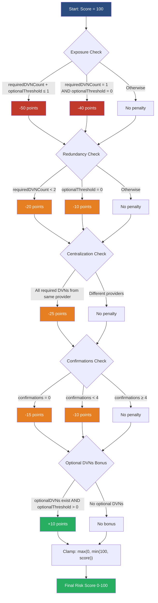

<!-- omit in toc -->
# LayerZero OApp Security Scanner
[](https://opensource.org/licenses/MIT)
[](https://www.python.org/)
[](https://www.djangoproject.com/)
[](https://nextjs.org/)

<!-- omit in toc -->
## Table of Contents
- [Overview](#overview)
- [Features](#features)
- [Context \& Problem Statement](#context--problem-statement)
  - [The KelpDAO Incident](#the-kelpdao-incident)
  - [The Scale of the Problem](#the-scale-of-the-problem)
  - [LayerZero's Response](#layerzeros-response)
  - [Why This Tool Exists](#why-this-tool-exists)
- [Links \& References](#links--references)
- [Diagrams \& Visuals](#diagrams--visuals)
  - [Risk Calculation Diagram](#risk-calculation-diagram)
  - [UI Screenshots](#ui-screenshots)
- [Future Extensions](#future-extensions)
- [Architecture](#architecture)
- [Technical Stack](#technical-stack)
- [Getting Started](#getting-started)
  - [Prerequisites](#prerequisites)
    - [For Only Viewing the Frontend Locally](#for-only-viewing-the-frontend-locally)
    - [To Optionally Deploy the Backend Yourself](#to-optionally-deploy-the-backend-yourself)
  - [Clone the Repository](#clone-the-repository)
  - [View the Frontend](#view-the-frontend)
- [Backend Setup](#backend-setup)
  - [1. Generate a Django secret key](#1-generate-a-django-secret-key)
  - [2. Configure the database](#2-configure-the-database)
  - [3. Set environment variables](#3-set-environment-variables)
  - [4. Install dependencies and run migrations](#4-install-dependencies-and-run-migrations)
- [API Endpoints](#api-endpoints)
- [License](#license)


## Overview 

This LayerZero OApp Security Monitor is a full‑stack tool that monitors Decentralized Verifier Network (DVN) configurations for LayerZero OApps. It detects dangerous 1‑of‑1 DVN setups, centralization risks, low‑confirmation finality attacks, EOA owner risks, vulnerable proxy and timelock configurations as well as stale oracles. The system includes a Django backend, a Next.js frontend, user authentication, alert channels (Discord), security reports, and a public suggestion form.


## Features

- **Automated OApp Scanning**: Fetches the `UlnConfig` via LayerZero EndpointV2 on multiple chains (Ethereum, Arbitrum, Optimism, BSC, and Base).
- **Risk Scoring**: Computes a score (0‑100) and grade (A‑F) based on `requiredDVNCount`, optional thresholds, provider diversity, and confirmations.
- **User Accounts**: Register, login (JWT), manage monitored OApps, and configure alert channels (Discord webhook).
- **Public Monitor**: View all scanned configs with pagination, filters, and search.
- **Public OApp Submission**: Anyone can suggest an OApp to be scanned (rate‑limited to 10/hour per IP).
- **Discord Alerts**: Notifies users when a monitored OApp becomes unhealthy.
- **Automated Security Reports**: Automatically creates a security report containing all unhealthy configurations.


## Context & Problem Statement

### The KelpDAO Incident

On April 18, 2026, KelpDAO suffered a $292 million exploit via LayerZero's messaging infrastructure. The attackers forged a cross-chain message that drained rsETH from KelpDAO's LayerZero bridge. This was due to an insecure 1-of-1 DVN (Decentralized Verifier Network) configuration (the minimum security setting) in which a single validator approval was required to execute cross-chain transactions.

LayerZero later [confirmed](https://layerzero.network/blog/kelpdao-incident-statement) that applications using multi-DVN configurations (`requiredDVNCount >= 2`) were not affected and could confidently resume operations. They also announced they will no longer sign or attest messages from applications using 1/1 configurations, effectively deprecating the minimum security setup.

### The Scale of the Problem

[Dune Analytics data](https://www.kucoin.com/news/flash/dune-data-47-of-layerzero-oapps-use-1-of-1-dvn-setup) reveals that among approximately 2,665 active LayerZero OApp contracts over a 90-day period:

| Configuration | Percentage | Projects |
|---------------|------------|----------|
| **1-of-1** | **47%** | **~1,252** |
| 2-of-2 | 45% | ~1,199 |
| 3-of-3 or higher | ~5% | ~133 |

This means 1,252 projects, representing over $4.5 billion in associated market value, remain exposed to the same class of risk that enabled the KelpDAO hack.

### LayerZero's Response

In response to the incident, LayerZero has [effectively deprecated 1-of-1 configurations](https://layerzero.network/blog/kelpdao-incident-statement) by announcing they will no longer sign or attest messages from applications using them. While LayerZero is not strictly enforcing a hard-minimum required DVN count, the policy change strongly nudges projects away from the insecure default.

However, until projects actively choose to migrate to multi-DVN setups, and for any OApps that manually configure risky settings, the exposure risk persists. The 1-of-1 configuration is still the default for new deployments, and existing OApps will not automatically upgrade.

### Why This Tool Exists

The KelpDAO hack proved that configuration is the weakest link in cross-chain security. LayerZero's own policy change confirms that 1-of-1 setups are unacceptable. This scanner provides:

- **Real-time visibility** into which OApps are using risky 1-of-1 DVN configurations
- **Actionable risk scoring** (0–100) and grades (A–F)
- **Continuous monitoring** with alerts when configurations become unhealthy
- **Public transparency** so the entire ecosystem can see which protocols are secure

By catching these vulnerabilities before they're exploited (or before LayerZero's policy effectively halts their operations) this tool helps projects stay secure and compliant.


## Links & References
[Vercel Deployment Link](PLACEHOLDER)


## Diagrams & Visuals

### Risk Calculation Diagram


### UI Screenshots


## Future Extensions

Due to time constraints, the MVP focused on LayerZero. Planned extensions include:

- **Multi‑protocol Support**: adapt the scanner to CCIP (check DON signer thresholds), Wormhole (guardian set size), and Axelar (validator changes). The core risk of a single verifier is universal.
- **Email Alerts**: integrate Resend for email notifications.
- **Historical Trends**: store configuration changes over time to visualise risk evolution.
- **Slack/Telegram Notifications**:  additional alert channels.
- **On‑chain Metrics**: track `requiredDVNCount` changes via events.


## Architecture

**Backend**: Django + Django REST Framework + djoser (JWT)
**Database**: SQLite (development), PostgreSQL (production)
**Scanner**: Custom management command (scan_bridges) +  GitHub Actions
**Frontend**: Next.js (App Router) + TailwindCSS
**Deployment**: Backend on Render/Railway, Frontend on Vercel


## Technical Stack

| Area | Technologies |
|------|--------------|
| Backend | Django 5.2, DRF, djoser, simple‑jwt, web3.py, eth‑abi, requests |
| Frontend | Next.js 16.2.7, React, TailwindCSS, Axios, Lucide React |
| Database | SQLite (development), PostgreSQL (production) |
| Blockchain | LayerZero EndpointV2, Alchemy RPC |
| Notifications | Discord webhooks |


## Getting Started

To only view the monitor without cloning the repository, visit this link: PLACEHOLDER.

### Prerequisites

#### For Only Viewing the Frontend Locally
- Node.js (v18+) and npm

#### To Optionally Deploy the Backend Yourself
- Python 3.11+
- Redis (for rate limiting) 
- A .env file
- RPC URLs for Ethereum, Arbitrum, BSC (BNB Smart Contract Chain), and Base (e.g., from [Alchemy](https://www.alchemy.com/) or [Infura](https://infura.io/))


### Clone the Repository
```bash
git clone https://github.com/vridhib/layerzero-oapp-security-monitor
cd layerzero-oapp-security-monitor
```

### View the Frontend

Open a terminal and run the following commands:
```bash
cd frontend
npm install
npm run dev
```

Now, open http://localhost:3000 to view the monitor.


## Backend Setup

To setup the backend yourself, follow the directions below.

### 1. Generate a Django secret key
```bash
python -c "from django.core.management.utils import get_random_secret_key; print(get_random_secret_key())"
```

### 2. Configure the database

For local development, use SQLite. In `backend/settings.py`, comment out PostgreSQL and uncomment SQLite:

```py
# DATABASES = {
#     'default': {
#         'ENGINE': 'django.db.backends.postgresql',
#         'NAME': os.getenv('DB_NAME', 'layerzero_monitor'),
#         'USER': os.getenv('DB_USER'),
#         'PASSWORD': os.getenv('DB_PASSWORD'),
#         'HOST': os.getenv('DB_HOST', 'localhost'),
#         'PORT': os.getenv('DB_PORT', '5432'),
#     }
# }

DATABASES = {
     'default': {
         'ENGINE': 'django.db.backends.sqlite3',
         'NAME': BASE_DIR / 'db.sqlite3',
     }
 }
```

### 3. Set environment variables

Copy .env.example to .env:

```bash
cp .env.example .env
```

Add your RPC URLs and Django secret key::
```bash
# Blockchain RPC URLs
ETH_RPC=
ARB_RPC=
BSC_RPC=
BASE_RPC=

# Django secret key
DJANGO_SECRET_KEY=
```

### 4. Install dependencies and run migrations
```bash
# Create virtual environment
python -m venv venv
source venv/bin/activate   # Linux/Mac
# or venv\Scripts\activate on Windows

# Install dependencies
pip install -r requirements.txt

# Run migrations
python manage.py migrate

# Create a superuser (optional)
python manage.py createsuperuser

# Seed initial data from LayerZero metadata
python manage.py seed_oapps

# Run the first scan
python manage.py scan_bridges

# Start the Django development server
python manage.py runserver
```

## API Endpoints
| Endpoint          | Method | Auth Required | Description |
|-------------------|--------|-------------|-------------|
|/api/auth/jwt/create/|	POST|	No |Login (returns JWT)|
|/api/auth/users/	|POST	| No |Registration|
|/api/dvn-configs/|	GET	| No| Public list of scanned configs (pagination, filter, search)|
/api/monitored-oapps/|	GET/POST/DELETE|	Yes |User’s monitored OApps (authenticated)|
/api/alert-channels/|	GET/POST/DELETE|	Yes | User’s alert channels (authenticated)|
/api/public/add-oapp/|	POST|	No | Suggest an OApp (rate‑limited)|
/api/security-reports/| GET| No | Public list of all security reports


## License
This project is licensed under the MIT License. See the [full license text](https://opensource.org/licenses/MIT) for details.